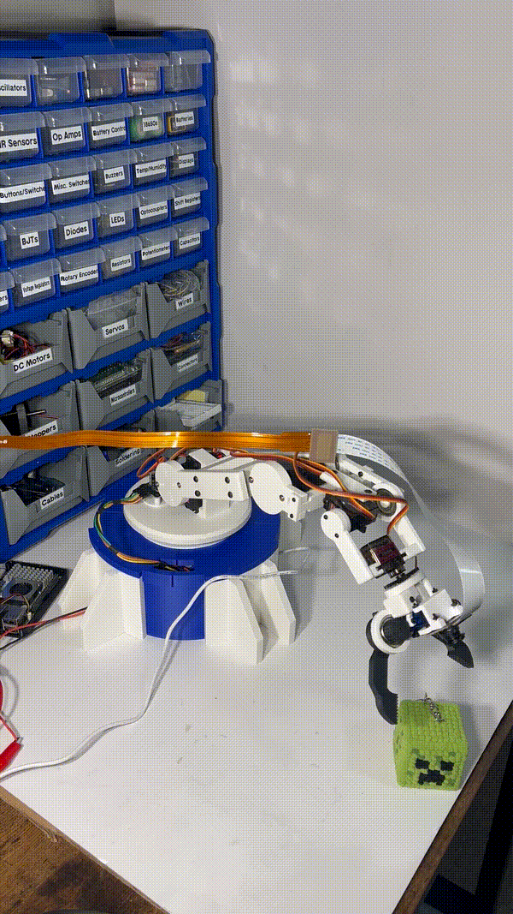

# Desktop Robot Arm

A 3D-printed desktop robot arm built from scratch, integrating robotics, embedded control, kinematics, and computer vision.

The arm is controlled by an ESP32 and uses a Raspberry Pi 5 with an eye-in-hand camera for computer vision. Motion control, forward/inverse kinematics, and a custom-trained YOLO object detection model are currently working, with the end goal of autonomous vision-guided pick and place.

> Current status: Object detection and arm control are working independently. I'm currently working on connecting the vision and control systems for autonomous manipulation.

## Demo

*Robot arm executing a pose command*

## Features

* Fully custom mechanical design in Fusion 360
* 3D-printed arm and gripper
* 5 controlled joints + gripper
* ESP32-based motion control
* NEMA 17 base driven by a TMC2209
* PCA9685 servo control
* Forward and inverse kinematics
* Cartesian end-effector positioning
* Non-blocking servo motion
* Raspberry Pi 5 computer vision
* Eye-in-hand IMX219 camera
* Custom YOLO object detection model
* Custom dataset captured from the robot's camera
* Vision-guided pick and place *(in progress)*

## Hardware

* ESP32 dev board
* Raspberry Pi 5 (8 GB)
* PCA9685 servo driver
* TMC2209 stepper motor driver
* NEMA 17 stepper motor
* MG996R servo x2
* 21G servo
* MG90S micro servo
* SG90 micro servo
* IMX219 camera
* 6V servo & stepper power supply
* Lazy Susan bearing
* 608 ball bearing x3
* Custom 3D-printed mechanical components
* Various fasteners and mounting hardware

## Mechanical Design

The arm was designed from scratch in Fusion 360 and went through a few iterations as I built and tested it.

The base is driven by a NEMA 17 stepper motor, while the shoulder, elbow, wrist, and gripper are servo-driven. The final arm has control over:

1. Base rotation
2. Shoulder pitch
3. Elbow pitch
4. Wrist pitch
5. Wrist roll
6. Gripper

*High-angle CAD view of the complete robot arm assembly.*

A lot of the mechanical design ended up being driven by problems found during testing. For example, an early version of the base coupling had rotational slip, so I redesigned it with a tapered D-bore and external taper to improve repeatability. There was another issue where the wrist pitch servo screw did not adequately support the rest of the arm, so I designed a custom bracket to secure it in place.

Custom components include:

* Base and rotating platform
* Upper arm and forearm
* Wrist assembly
* Gripper
* Servo mounts
* Camera mount
* Electronics mounting components

## Electronics

The electronics are split between the ESP32 motion control system and the Raspberry Pi vision system.

The ESP32 controls the servos through the PCA9685 over I²C and configures the TMC2209 stepper driver over UART.

The main electronics include:

* ESP32 for real-time arm control
* PCA9685 for servo PWM control
* TMC2209 for NEMA 17 stepper control
* Dedicated 6V supply for the servos
* Raspberry Pi 5 for computer vision and high-level control
* IMX219 camera mounted to the arm

The TMC2209 is configured through UART, allowing settings such as motor current and microstepping to be controlled in software.

*CAD view of the electronics layout inside the robot arm base.*

*Final electronics implementation inside the robot base.*

## Control System

The Raspberry Pi handles computer vision and higher-level decision making, while the ESP32 handles the actual motion of the arm.

The ESP32 firmware handles:

* Servo and stepper control
* Joint calibration
* Forward kinematics
* Inverse kinematics
* Cartesian pose commands
* Smooth multi-joint movement

### Motion Control

The arm can be controlled using either individual joint angles or Cartesian end-effector poses.

Forward kinematics calculate the end-effector position from the current joint angles, while inverse kinematics calculate the required joint angles for a desired position and orientation.

A calibration layer converts the mathematical joint angles into the actual servo coordinate system and accounts for servo direction, offsets, and mechanical limits.

Servo motion is also interpolated without blocking the main control loop, allowing multiple joints to move smoothly at the same time.

## Computer Vision

Computer vision runs on the Raspberry Pi 5 using an IMX219 camera mounted directly to the arm.

*Example training image captured from the arm's eye-in-hand camera.*

I initially experimented with OpenCV ORB feature matching, but it wasn't reliable enough across different viewpoints. I then moved to a learned object detection approach using Ultralytics YOLO.

The current model is trained on a custom dataset of approximately 500 images collected from the robot's own camera.

The training process includes:

* Capturing images using the Raspberry Pi camera
* Annotating objects in the dataset
* Converting annotations to YOLO format
* Training the model using transfer learning
* Testing the model on unseen images
* Deploying the trained weights back to the Raspberry Pi for inference

*Example inference using the custom-trained YOLO model.*

## Vision-Guided Pick and Place

The current goal is to combine the vision and motion systems into a closed-loop pick-and-place pipeline.

Rather than relying on a single camera measurement, the eye-in-hand setup will allow the arm to repeatedly detect the target and correct its position as it approaches.

The planned process is:

1. Detect the target object (creeper)
2. Move toward the target
3. Capture a new image
4. Correct the arm's position
5. Grasp the object
6. Locate and move toward the goal (detonation zone...)
7. Release the object

This part of the project is currently in development.

## Software

* C++ - ESP32 firmware and arm control
* Python - computer vision, dataset tools, and inference
* Fusion 360 - mechanical design
* OpenCV - image processing and early CV experiments
* Ultralytics YOLO - object detection
* AccelStepper / TMCStepper - stepper control
* Adafruit PCA9685 - servo control

## Development Process

The project has been developed and tested incrementally:

* Designed and assembled the mechanical arm
* Tested and calibrated each actuator individually
* Integrated PCA9685 servo control
* Added NEMA 17 base rotation using the TMC2209
* Configured TMC2209 UART communication
* Implemented smooth, non-blocking joint movement
* Developed and validated forward kinematics
* Developed and validated inverse kinematics
* Added Cartesian pose control
* Integrated the Raspberry Pi 5 and eye-in-hand camera
* Experimented with OpenCV feature matching
* Built a custom dataset capture and annotation workflow
* Trained and tested a custom YOLO object detection model
* Deployed object detection to the Raspberry Pi
* Began integrating the vision and motion control systems

## Challenges & Lessons Learned (so far)

* Mechanical repeatability:

  * Initial base coupling had significant rotational slip
  * Redesigned the coupling using a tapered D-bore and external taper
  * Added a custom wrist pitch bracket after identifying excessive movement around the servo mounting point

* Stepper control:

  * Configured the TMC2209 through UART
  * Tuned motor current, microstepping, speed, and acceleration
  * Debugged hardware and UART communication issues during integration

* Servo calibration:

  * Individually calibrated servo pulse-width ranges
  * Added mappings between mathematical joint angles and physical servo positions

* Kinematics:

  * Developed forward and inverse kinematics based on the arm's geometry
  * Worked through joint coordinate systems, offsets, and end-effector orientation
  * Validated calculated poses against the physical arm

* Computer vision:

  * Found traditional feature matching unreliable with changing camera viewpoints
  * Moved to a learned object detection approach using transfer learning
  * Collected a custom dataset from the robot's actual operating perspective

* Camera integration:

  * Integrated the camera into the moving arm while accounting for cable routing and joint movement
  * Built the image capture workflow directly around the Raspberry Pi camera

## Current Progress

* [x] Mechanical design and assembly
* [x] Individual joint control
* [x] Multi-joint motion
* [x] Stepper base control
* [x] Forward kinematics
* [x] Inverse kinematics
* [x] Cartesian pose commands
* [x] Eye-in-hand camera integration
* [x] Dataset capture and annotation pipeline
* [x] Custom YOLO object detection
* [x] Raspberry Pi inference
* [ ] Raspberry Pi ↔ ESP32 communication
* [ ] Vision-based position correction
* [ ] Closed-loop visual servoing
* [ ] Autonomous grasping
* [ ] Autonomous pick and place

## Next Goals

The main focus right now is getting the Raspberry Pi and ESP32 talking and using the camera feedback to guide the arm toward detected objects.

From there, the goal is a fully autonomous demo: find an object, pick it up, locate the goal, and place it.
