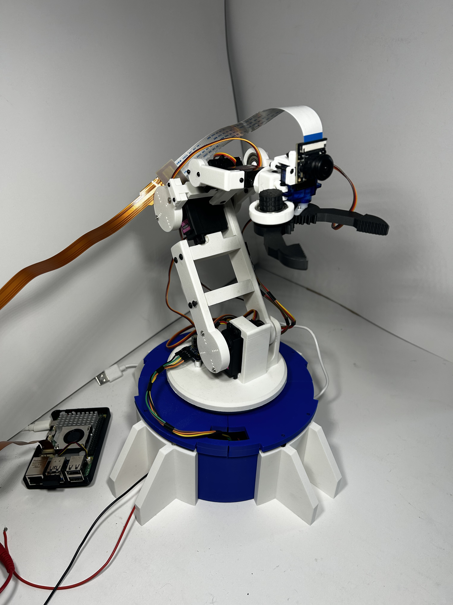
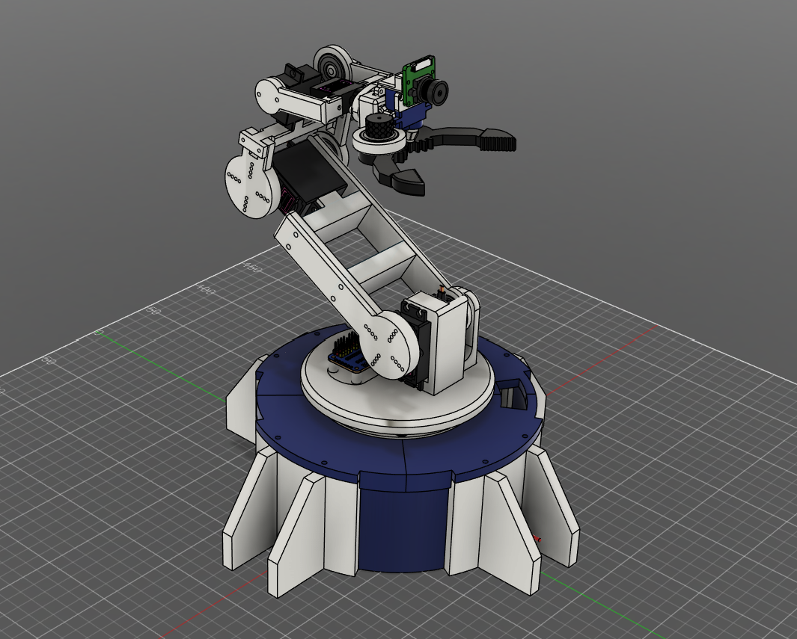
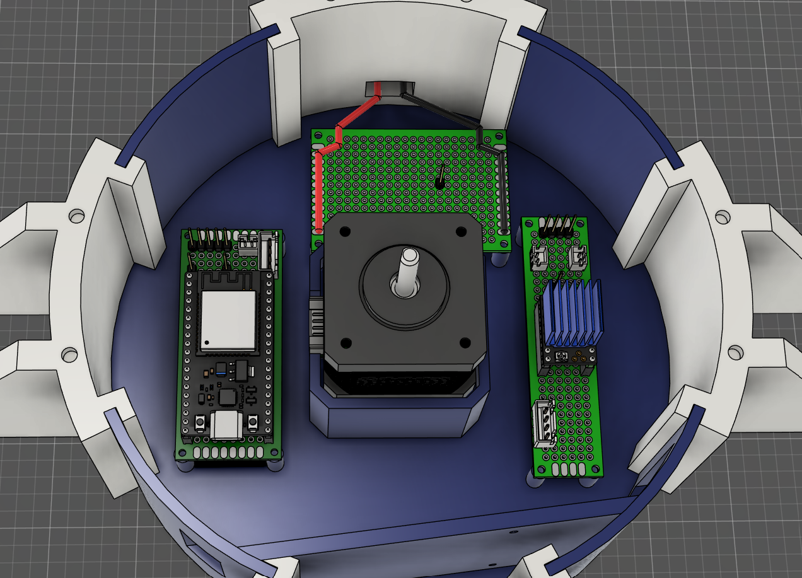
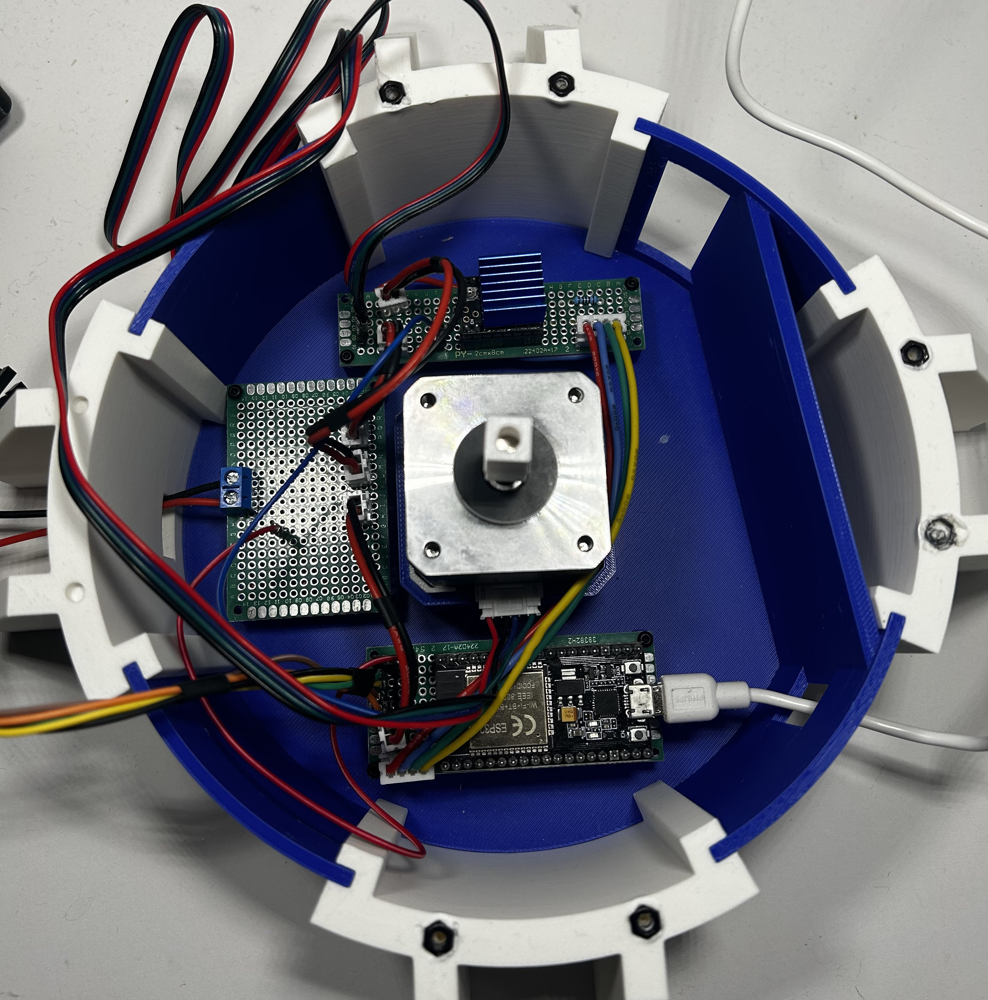
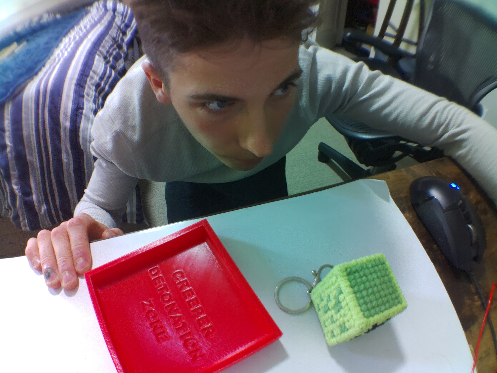
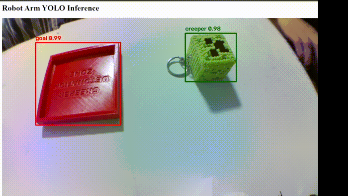

# Desktop Robot Arm

A 3D-printed desktop robot arm built from scratch, integrating robotics, embedded control, kinematics, and computer vision.

The arm is controlled by an ESP32 and uses a Raspberry Pi 5 with an eye-in-hand camera for computer vision. It combines custom motion control, forward/inverse kinematics, a custom-trained YOLO object detector, and closed-loop visual servoing to autonomously detect, approach, grasp, and place objects.

> Status: Object detection and arm control are integrated and working together to carry out autonomous pick-and-place tasks.

## Demo

*Autonomous pick-and-place demo with the robot’s POV shown above*

## Features

* Fully custom mechanical design in Fusion 360
* 3D-printed arm and gripper
* 5 controlled joints + gripper
* NEMA 17 stepper-driven base with TMC2209 control
* PCA9685-based servo control
* ESP32-based motion control
* Forward and inverse kinematics
* Cartesian end-effector positioning
* Non-blocking multi-joint servo motion
* Safe joint-angle limits and servo calibration
* Raspberry Pi 5 high-level control and computer vision
* Eye-in-hand IMX219 camera
* Custom YOLO object detection model
* Custom dataset captured from the robot's camera
* Raspberry Pi ↔ ESP32 serial communication
* Camera-space to robot-space coordinate transformation
* Closed-loop visual servoing with tunable Cartesian correction gains
* Autonomous target centering and approach
* Pitch retry logic for unreachable or unsuitable Cartesian poses
* Autonomous motion sequencing for grasping, goal alignment, placement, and return-home behavior
* Fully autonomous vision-guided pick and place

## Hardware

* ESP32 dev board
* Raspberry Pi 5 (8 GB)
* PCA9685 servo driver
* TMC2209 stepper motor driver
* NEMA 17 stepper motor
* MG996R servo x2
* 21G servo
* MG90S micro servo
* SG90 micro servo
* IMX219 camera
* 6V servo & stepper power supply
* Lazy Susan bearing
* 608 ball bearing x3
* Custom 3D-printed mechanical components
* Various fasteners and mounting hardware

## Mechanical Design

The arm was designed from scratch in Fusion 360 and went through a few iterations as I built and tested it.

The base is driven by a NEMA 17 stepper motor, while the shoulder, elbow, wrist, and gripper are servo-driven. The final arm has control over:

1. Base rotation
2. Shoulder pitch
3. Elbow pitch
4. Wrist pitch
5. Wrist roll
6. Gripper

*High-angle CAD view of the complete robot arm assembly.*

A lot of the mechanical design ended up being driven by problems found during testing. For example, an early version of the base coupling had rotational slip, so I redesigned it with a tapered D-bore and external taper to improve repeatability. There was another issue where the wrist pitch servo screw did not adequately support the rest of the arm, so I designed a custom bracket to secure it in place.

Custom components include:

* Base and rotating platform
* Upper arm and forearm
* Wrist assembly
* Gripper
* Servo mounts
* Camera mount
* Electronics mounting components

## Electronics

The electronics are split between the ESP32 motion control system and the Raspberry Pi vision system.

The ESP32 controls the servos through the PCA9685 over I²C and configures the TMC2209 stepper driver over UART.

The main electronics include:

* ESP32 for real-time arm control
* PCA9685 for servo PWM control
* TMC2209 for NEMA 17 stepper control
* Dedicated 6V supply for the servos
* Raspberry Pi 5 for computer vision and high-level control
* IMX219 camera mounted to the arm

The system intentionally separates high-level perception and sequencing from low-level actuator control. The Raspberry Pi handles vision and task logic, while the ESP32 handles deterministic joint motion, calibration, and kinematics. 

- Raspberry Pi 5 communicates with the ESP32 over USB serial
- ESP32 receives Cartesian and joint commands
- ESP32 exposes current arm pose/state back to the Pi

The TMC2209 is configured through UART, allowing settings such as motor current and microstepping to be controlled in software.

*CAD view of the electronics layout inside the robot arm base.*

*Final electronics implementation inside the robot base.*

## Control System

The Raspberry Pi handles computer vision and higher-level decision making, while the ESP32 handles the actual motion of the arm.

The ESP32 firmware handles:

* Servo and stepper control
* Joint calibration
* Forward kinematics
* Inverse kinematics
* Cartesian pose commands
* Smooth multi-joint movement
* Safe joint limits
* Pose validation/rejection
* Servo pulse calibration
* Robot-state reporting over serial
* Joint-space and Cartesian command interfaces

### Motion Control

The arm can be controlled using either individual joint angles or Cartesian end-effector poses.

Forward kinematics calculate the end-effector position from the current joint angles, while inverse kinematics calculate the required joint angles for a desired position and orientation.

A calibration layer converts the mathematical joint angles into the actual servo coordinate system and accounts for servo direction, offsets, and mechanical limits.

Servo motion is also interpolated without blocking the main control loop, allowing multiple joints to move smoothly at the same time.

### Safety & Calibration

Each actuator has individually calibrated pulse-width and angular limits to prevent commands from driving the arm beyond its physical range. Cartesian poses are validated before execution, and the mapping layer converts mathematical joint angles into the physical coordinate system of each servo.

Custom classes were created for servo and stepper control, FK/IK, joint mapping, and higher-level robot arm control.

## Computer Vision

Computer vision runs on the Raspberry Pi 5 using an IMX219 camera mounted directly to the arm.

*Example training image captured from the arm's eye-in-hand camera.*

I initially experimented with OpenCV ORB feature matching, but it wasn't reliable enough across different viewpoints. I then moved to a learned object detection approach using Ultralytics YOLO.

The current model is trained on a custom dataset of 625 images collected from the robot's own camera.

The training process includes:

* Custom Python dataset capture scripts using the eye-in-hand camera
* Annotation conversion tooling
* Transfer learning from pretrained YOLO weights
* Manual training-parameter tuning, including layer freezing and training duration
* Custom multi-class detection for the Creeper and goal
* Deployment to the Raspberry Pi for live inference

Training was performed using transfer learning rather than training a detector from scratch. I experimented with layer freezing, epoch count, batch size, and train/validation splits to balance training time and model performance before deploying the resulting weights to the Raspberry Pi.

*Example inference using the custom-trained YOLO model.*

## Visual Servoing & Autonomous Pick and Place

Instead of relying on a precisely calibrated external camera or a single position estimate, I chose an eye-in-hand visual-servoing approach. This allowed me to use a low-cost camera mounted directly to the arm and continuously correct the robot's position using live image feedback.

The visual servoing process is:

1. Detect Creeper using the YOLO model
2. Calculate bounding-box error relative to the desired camera target
3. Normalize image-space error
4. Apply tunable Cartesian gains
5. Transform the correction from camera coordinates into the robot coordinate frame
6. Request the current Cartesian arm pose from the ESP32
7. Send the corrected Cartesian pose
8. Repeat until the target is centered
9. Execute autonomous approach and grasp
10. Return to start pose
11. Detect and center on the goal
12. Move to placement pose and release
13. Return home

Because some desired Cartesian corrections could produce unreachable or mechanically unsafe configurations, the high-level motion sequence includes retry logic that adjusts the end-effector pitch before attempting the pose again.

## Software

* C++ - ESP32 firmware, actuator control, calibration, forward/inverse kinematics, Cartesian motion, and safety limits
* Python - computer vision, YOLO training, visual servoing, motion sequencing, serial communication, dataset tools, and web interface
* Fusion 360 - mechanical design
* OpenCV - image processing and early CV experiments
* Ultralytics YOLO - object detection
* AccelStepper / TMCStepper - stepper control
* Adafruit PCA9685 - servo control

## Development Process

The project has been developed and tested incrementally:

* Mechanical design and actuator integration
* Servo and stepper calibration
* Non-blocking motion control
* FK/IK and Cartesian control
* Raspberry Pi camera integration
* Custom YOLO dataset and training pipeline
* Pi ↔ ESP32 serial protocol
* Closed-loop visual servoing
* Autonomous motion sequencing
* Successful autonomous pick-and-place

## Challenges & Lessons Learned

* Mechanical repeatability:

  * Initial base coupling had significant rotational slip
  * Redesigned the coupling using a tapered D-bore and external taper
  * Added a custom wrist pitch bracket after identifying excessive movement around the servo mounting point

* Stepper control:

  * Configured the TMC2209 through UART
  * Tuned motor current, microstepping, speed, and acceleration
  * Debugged hardware and UART communication issues during integration

* Servo calibration:

  * Individually calibrated servo pulse-width ranges
  * Added mappings between mathematical joint angles and physical servo positions

* Kinematics:

  * Developed forward and inverse kinematics based on the arm's geometry
  * Worked through joint coordinate systems, offsets, and end-effector orientation
  * Validated calculated poses against the physical arm

* Computer vision:

  * Found traditional feature matching unreliable with changing camera viewpoints
  * Moved to a learned object detection approach using transfer learning
  * Collected a custom dataset from the robot's actual operating perspective

* Camera integration:

  * Integrated the camera into the moving arm while accounting for cable routing and joint movement
  * Built the image capture workflow directly around the Raspberry Pi camera

* Visual servoing:

  * Converted image-space bounding-box error into normalized Cartesian corrections
  * Tuned Cartesian gains and deadbands to reduce oscillation
  * Transformed camera-relative corrections into the robot frame using the arm's current orientation
  * Added retry logic for unreachable Cartesian poses
  * Learned that detection accuracy alone does not guarantee reliable manipulation

* System integration:

  * Designed a serial command protocol between Raspberry Pi and ESP32
  * Added robot-state queries so vision corrections could use the arm's current Cartesian pose
  * Built a motion state machine to coordinate centering, approach, grasp, goal alignment, placement, and return-home behavior

## Completed Milestones

* [x] Mechanical design and assembly
* [x] Individual joint control
* [x] Multi-joint motion
* [x] Stepper base control
* [x] Forward kinematics
* [x] Inverse kinematics
* [x] Cartesian pose commands
* [x] Eye-in-hand camera integration
* [x] Dataset capture and annotation pipeline
* [x] Custom YOLO object detection
* [x] Raspberry Pi inference
* [x] Raspberry Pi ↔ ESP32 communication
* [x] Vision-based position correction
* [x] Closed-loop visual servoing
* [x] Autonomous grasping
* [x] Autonomous pick and place

## Possible Future Improvements

* Faster object detection / hardware acceleration
* Improved mechanical repeatability
* Better trajectory planning
* More generalized object classes
* Depth estimation or stereo vision
* Simulation / ROS integration
